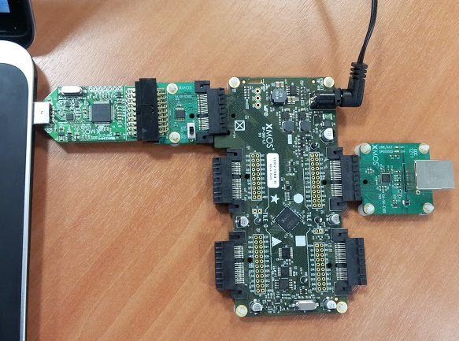

.. _Slicekit_Simple_Webserver_Quickstart:

Ethernet Slice Simple Webserver Application Quickstart
------------------------------------------------------

This simple demonstration of xTIMEcomposer Studio functionality uses
the sliceKIT Ethernet Slice together with the xSOFTip TCP/IP Ethernet
component to:

   * Run a TCP/IP stack on the xCORE
   * Run a very simple HTTP server to display a "hello world" webpage

Hardware setup
++++++++++++++

The sliceKIT Core Board has four slots with edge conectors: ``SQUARE``, ``CIRCLE``, ``TRIANGLE`` and ``STAR``.

To setup up the system:

   #. Connect the Ethernet Slice Card to the sliceKIT Core Board using the connector marked with the ``CIRCLE``.
   #. Connect the xTAG Adapter to sliceKIT Core Board and connect XTAG-2 to the adapter.
   #. Connect the xTAG-2 to host PC. Note that a USB cable is not provided with the sliceKIT starter kit.
   #. Plug the power supply into the sliceKIT Core Board and turn the
      power supply on.

   Hardware Setup for Simple HTTP Demo
   
	
Import and build the application
++++++++++++++++++++++++++++++++

   #. On your PC, open xTIMEcomposer. You need to be in the
      edit perspective (Window->Open Perspective->XMOS Edit).
      If the XMOS Edit option isn't in the list, you are
      already in the edit perspective.
   #. Locate the ``'Simple HTTP Demo'`` item in the xSOFTip pane on the
      bottom left of the window and drag it into the Project Explorer
      window in the xTIMEcomposer. This will also cause the modules on
      which this application depends to be imported as well.
   #. Click on the app_simple_webserver item in the Explorer pane then
      click on the build icon (hammer) in xTIMEcomposer. Check the
      console window to verify that the application has built successfully.

For help in using xTIMEcomposer, try the xTIMEcomposer tutorials, which you can find by selecting Help->Tutorials from the xTIMEcomposer menu.

Note that the Developer Column in the xTIMEcomposer on the right hand
side of your screen provides information on the xSOFTip components you
are using. Select the ``module_xtcp`` component in the Project
Explorer, and you will see its description together with API
documentation (reached by double clicking on the ``Documentation``
item within the project). If you view other documentation, you can get
back to this quickstart guide by cliking the `back` icon in the
Developer Column until you return to this quickstart guide.

Run the application
+++++++++++++++++++

Now that the application has been compiled, the next step is to run it
on the sliceKIT Core Board using the tools to load the application
over JTAG (via the XTAG-2 and XTAG Adaptor Card)
into the xCORE multicore microcontroller.

   #. Click on the ``Run`` icon (the white arrow in the green
      circle). The debug console window in xTIMEcomposer should then
      display the message::

       **WELCOME TO THE SIMPLE WEBSERVER DEMO**

      This has been generated from the application code via a call to
      the ``printstr()`` function.
   #. Connect the sliceKIT Ethernet Slice your network via an ethernet
      cable. The application is configured by default to use DHCP to
      obtain an IP address. If you wish to change this to a static IP
      address edit the ``main.xc`` file in the application (you can
      reach this via the Project Explorer in the xTIMEcomposer) and
      change the ``ipconfig`` data structure.
   #. The console window should display a message like::

       IP Address: 192.168.0.4

      the actual IP address will depend on your local network.

   #. From a PC connected to the same network, open a web browser and
      open the link::

        http://192.168.0.4

      using the IP adress printed out by the application. This should
      display a "hello world" webpage. You have now got the ethernet
      slice up and running.

Troubleshooting
+++++++++++++++

If the demo does not work try the following:

  * Ensure the Ethernet Slice Card is connected to the CIRCLE
    connector of the core board.
  * Ensure the slice network cable is fully connected. There are
    activity LEDs next to the ethernet connector that should
    illuminate if connected.
  * Ensure that both the PC and Ethernet Slice card are connected to the
    same network and can route to each other. If you are using a
    dynamically allocated address, make sure your DHCP server is
    configured correctly. If using a static address, make sure your PC
    is configured to talk to that address (in Windows you need to
    check your Network Adapter TCP/IP settings).

Next steps
++++++++++

Look at the Code
................

   #. Examine the application code. In xTIMEcomposer navigate to the ``src`` directory under ``app_simple_webserver`` and double click on the main.xc file within it. The file will open in the central editor window.
   #. Find the main function and note that it runs the
      ``ethernet_xtcp_server()`` (which runs the ethernet driver and tcp
      stack) and the ``xhttpd()`` function in parallel.
   #. Look at the ``xhttpd.xc`` and ``httpd.xc`` files. These
      implement the webserver logic that connects to the TCP/IP
      stack. In particular the ``httpd_handle_event`` function that
      responds to a TCP event over an xC channel and performs the
      functions of the webserver. See the TCP/IP programming guide for
      details on how the ``xtcp`` stack works.

Look at Other Examples
......................

For a more complex embedded wbeserver demo that allows user interaction try the ``Slicekit GPIO and Ethernet Combo Demo`` demo application which can be found under sliceKIT->Demos categroy in the xSOFTip Explorer pane within xTIMEcomposer. 
